<p align="center">
  
</p>

<p align="center">
  <a href="https://claude.ai/artifact/RJ8dsCQrrkQUBzuwnMJszq"><b>Open the sessions page</b></a> ·
  <a href="#start-in-5-minutes">Start in 5 minutes</a> ·
  <a href="#your-learning-path">Learning path</a> ·
  <a href="https://github.com/aishajv/claude-everything">Install as plugins</a>
</p>

# Welcome 👋

**New to AI coding tools? You're in exactly the right place.**

You don't need any AI experience to use this repo. If you can open a terminal, you can follow along. Everything here is real and working: you can read it, run it, change it, and break it. Breaking things is how we learn.

This repo is the companion to the **AI Assisted Engineering** sessions. The sessions explain the ideas; this repo lets you see them working in a real project.

## What you'll learn

By the end, you'll understand how to make an AI assistant work *your* way:

- 🧠 **Skills:** teach Claude your team's way of doing things, once
- 🤖 **Subagents:** hand focused jobs to specialist helpers
- 🪝 **Hooks:** rules that always run, no matter what
- 🔐 **Permissions:** decide what Claude may do, may ask about, or may never touch

## Start in 5 minutes

1. **Install Claude Code:** follow the [official setup guide](https://code.claude.com/docs/en/overview).
2. **Get this repo:**
   ```bash
   git clone https://github.com/aishajv/ai-trainings.git
   cd ai-trainings
   ```
3. **Start Claude Code** in the folder:
   ```bash
   claude
   ```
4. **Ask it anything.** Try these to get started:
   ```text
   What skills, agents, and hooks does this project have?
   Explain the ticket-implementer agent in simple words.
   What would happen if an agent tried to read the .env file?
   ```

That's it. You're learning by exploring. 🎉

## Your learning path

Go at your own pace. Each step builds on the one before.

| Step | Learn | Look at | Try |
|---|---|---|---|
| 1 | **Project memory** | [`CLAUDE.md`](CLAUDE.md) | Ask Claude how to run the tests |
| 2 | **Skills** | [`.claude/skills/`](.claude/skills/) | Open a `SKILL.md`; notice the `description` that decides when it loads |
| 3 | **Subagents** | [`.claude/agents/`](.claude/agents/) | See how `skills:` preloads conventions into an agent |
| 4 | **Hooks** | [`.claude/hooks/`](.claude/hooks/) | Read `run-tests-before-done.sh`: the implementer cannot finish until `make test` passes |
| 5 | **Permissions** | [`.claude/settings.json`](.claude/settings.json) | Spot the three lists: `allow`, `ask`, `deny` |
| 6 | **Putting it together** | [The PR factory](#the-pr-factory-flow) | Run `/build-tickets-from-feature` on a small idea |

## What's inside

```
ai-trainings/
├── CLAUDE.md                          project memory, loaded in every session
└── .claude/
    ├── settings.json                  permissions: allow, ask, deny
    ├── skills/
    │   ├── python-fastapi-coding-conventions/
    │   ├── python-fastapi-test-conventions/
    │   ├── git-push-workflow/
    │   ├── modular-monolith-architecture/
    │   ├── design-multi-tenant-saas/
    │   ├── implementation-spec/
    │   ├── llm-integration/
    │   ├── build-tickets-from-feature/  orchestrator skill
    │   └── build-prs-from-tickets/      orchestrator skill
    ├── agents/
    │   ├── ticket-drafter.md          drafts tickets (read-only)
    │   ├── ticket-implementer.md      implements one ticket; its Stop hook runs the tests
    │   ├── diff-reviewer.md           reviews one ticket's diff (read-only)
    │   └── test-runner.md             runs `make test`
    └── hooks/
        └── run-tests-before-done.sh   runs make test when ticket-implementer finishes
```

## Where each concept lives

Some concepts are whole folders; others are a single key inside a file. Open the file and find the key.

| Concept | File | Look for | What it does |
|---|---|---|---|
| Project memory | [`CLAUDE.md`](CLAUDE.md) | the whole file | Facts Claude reads in every session |
| Skill | [`.claude/skills/*/SKILL.md`](.claude/skills/) | `description:` | Decides when the skill loads |
| Orchestrator skill | [`build-prs-from-tickets/SKILL.md`](.claude/skills/build-prs-from-tickets/SKILL.md) | "You are the orchestrator" | A skill that starts subagents and coordinates them |
| Subagent | [`.claude/agents/*.md`](.claude/agents/) | `name:`, `tools:`, `model:` | A focused helper with its own tools and model |
| Read-only agent | [`diff-reviewer.md`](.claude/agents/diff-reviewer.md) | `tools: Read, Grep, Glob` | No Bash, no Write: it can only read |
| Preloaded skills | [`ticket-implementer.md`](.claude/agents/ticket-implementer.md) | `skills:` | Conventions injected when the agent starts |
| Worktree isolation | [`ticket-implementer.md`](.claude/agents/ticket-implementer.md) | `isolation: worktree` | Its own copy of the repo, so agents never collide |
| Stop hook | [`ticket-implementer.md`](.claude/agents/ticket-implementer.md) | `hooks:` → `Stop:` | Runs when the agent tries to finish |
| Hook script | [`run-tests-before-done.sh`](.claude/hooks/run-tests-before-done.sh) | `exit 2` | Blocks finishing until `make test` passes |
| Permissions | [`.claude/settings.json`](.claude/settings.json) | `allow`, `ask`, `deny` | What Claude may do, must ask about, or may never do |

## The PR factory flow

Two **orchestrator skills** talk to you and hand the focused work to **subagents**. One feature goes in; reviewed, tested pull requests come out.

## Words you'll hear

| Word | In plain words |
|---|---|
| **Skill** | A note that teaches Claude how to do one thing. It loads only when it's useful. |
| **Subagent** | A helper Claude starts for one focused job, with its own fresh context. |
| **Orchestrator** | The skill that runs the show: talks to you and starts the subagents. |
| **Hook** | A script that runs at a fixed moment, such as before a command. It always runs. |
| **Permission** | A rule about what Claude may do without asking, must ask about, or may never do. |
| **Worktree** | A separate copy of the repo, so helpers can work in parallel without collisions. |

## Keep going

- 📚 **Sessions:** follow along with the [AI Assisted Engineering sessions](https://claude.ai/artifact/RJ8dsCQrrkQUBzuwnMJszq).
- 🧩 **Use it in your own projects:** the same setup comes as an installable plugin, [feature-to-pr-factory in claude-everything](https://github.com/aishajv/claude-everything/tree/main/plugins/feature-to-pr-factory).
- 💬 **Questions or ideas?** [Open an issue](https://github.com/aishajv/ai-trainings/issues). There are no silly questions here.

<p align="center"><sub>Built with curiosity, for curious people. Happy learning! ✨</sub></p>
